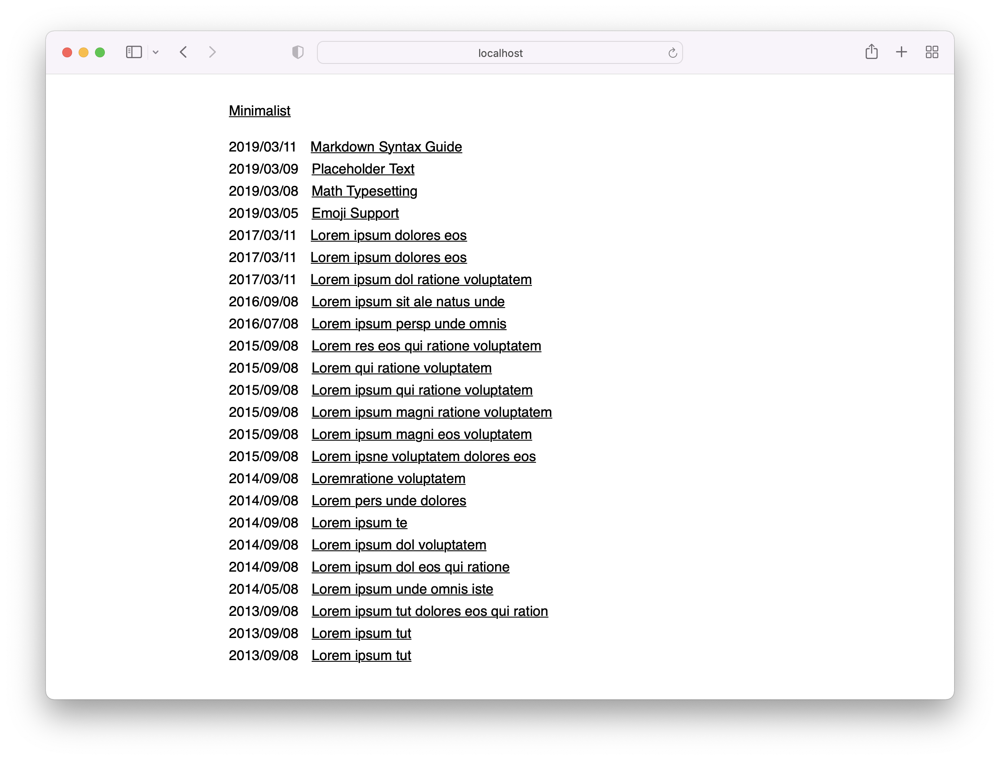

# Minimalist - Hugo theme

Minimalist is content focused, minimal theme for Hugo. The theme is perfectly suitable for writers. No JS! CSS only 692B! AAA, 100/100 scores on Lighthouse, Gmetrix and Webpagetest!

Demo: [https://minimalist-hugo.netlify.app/](https://minimalist-hugo.netlify.app/)

### Features

- Minimalistic, clean and simple design
- Perfect for writers
- Content focused
- System fonts
- NO JS!
- AAA, 100/100 scores on Lighthouse, Gmetrix and Webpagetest
- Responsive design
- Inline CSS
- Atom feed
- Sass
- SEO optimized (Twitter cards, Facebook Open Graph, Schema.org)
- Ultra fast
- CSS is only 692B!